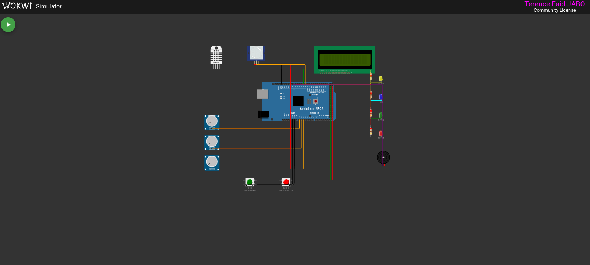

# SC-IES 


## Simulator Preview



> *Full simulation running in VS Code — Arduino Mega sensor node with PIR, DHT22, LCD, RFID buttons, and actuator LEDs.*

---

## What This Is

SC-IES is a prototype IoT system for university campus automation. It simulates a smart classroom (Room 101, UR-CST Block B) that can:

- Detect room occupancy via PIR sensor and auto-control lights and fan
- Monitor temperature, humidity, and CO2 levels continuously
- Log student attendance via RFID card scans
- Trigger emergency alerts for fire, flooding, or unauthorized access
- Output structured MQTT messages to a Raspberry Pi gateway over Serial

All hardware is emulated using **Wokwi** inside VS Code. No physical components required.

---

## System Architecture

```
Layer 1 — Perception      PIR · DHT22 · MQ-135 · MQ-2 · FC-37 · RFID RC522
Layer 2 — Device          Arduino Mega 2560 · Relay · LCD 16x2 · Buzzer
Layer 3 — Network         Raspberry Pi 4 · Mosquitto MQTT Broker
Layer 4 — Application     Python Flask · InfluxDB · MySQL · Rule Engine
Layer 5 — User Interface  React.js Dashboard · SMS via Twilio
```

This repo covers **Layers 1 and 2** — the sensor node firmware, fully simulated.

---

## Circuit Components

| Component | Model | Pin | Role |
|---|---|---|---|
| PIR Motion Sensor | HC-SR501 | D2 | Occupancy detection |
| Temp/Humidity | DHT22 | D3 | Environmental monitoring |
| Classroom Lights | LED (Yellow) | D4 | Relay simulation |
| Fan / AC | LED (Blue) | D5 | Relay simulation |
| Door Lock | LED (Green) | D6 | Relay simulation |
| Alert Indicator | LED (Red) | D7 | Emergency alert |
| Buzzer | Passive | D8 | Audio alerts |
| CO2 Sensor | MQ-135 / Knob | A0 | Air quality monitoring |
| Smoke Sensor | MQ-2 / Knob | A1 | Fire detection |
| Flood Sensor | FC-37 / Knob | A2 | Flood detection |
| RFID Auth | Green Button | D22 | Authorized card scan |
| RFID Unauth | Red Button | D23 | Unauthorized card scan |
| LCD Display | 16x2 I2C | SDA/SCL | Local status display |

---

## Setup Guide

### Requirements

- [VS Code](https://code.visualstudio.com/)
- VS Code extensions: **PlatformIO IDE**, **Wokwi Simulator**, **C/C++**
- A free Wokwi license (see step 3 below)

### 1 — Install PlatformIO Core

On Ubuntu/Debian:
```bash
sudo apt install pipx -y
pipx install platformio
pipx ensurepath
source ~/.bashrc
pio --version   # should print: PlatformIO Core, version 6.x.x
```

### 2 — Clone and open the project

```bash
git clone https://github.com/your-username/sc-ies.git
cd sc-ies
code .
```

### 3 — Get your free Wokwi license

Inside VS Code:
```
F1 → Wokwi: Request a Free License
```
Follow the browser link. Takes 30 seconds.

### 4 — Build the firmware

Click the **✓ checkmark** in the bottom blue VS Code status bar, or run:
```bash
pio run
```

Wait for:
```
[SUCCESS] Took X.XX seconds
```

### 5 — Start the simulation

```
F1 → Wokwi: Start Simulator → Enter
```

The circuit opens in a VS Code panel. Press **▶ Play**.

---

## How to Use the Simulation

| Action | How |
|---|---|
| Trigger motion / occupancy | Click the **orange/black dot** on the PIR sensor |
| Raise CO2 level | Turn **Knob 1** (left) clockwise |
| Simulate a fire | Turn **Knob 2** (middle) past ~65% |
| Simulate flooding | Turn **Knob 3** (right) past ~65% |
| Authorized RFID scan | Press the **green button** |
| Unauthorized RFID scan | Press the **red button** |

**What to observe:**

- **Yellow LED** turns ON when the room is occupied, OFF after 20 seconds of no motion
- **Blue LED** turns ON when temperature > 27°C or CO2 > 800 ppm
- **Green LED** briefly turns OFF (door unlocks) on an authorized RFID scan
- **Red LED + buzzer** activates on fire, flood, or unauthorized access
- **LCD display** shows live temperature, humidity, CO2, and room status
- **Serial Monitor** streams all MQTT JSON messages the gateway would receive

---

## Project Structure

```
sc-ies/
├── src/
│   └── main.cpp         # Sensor node firmware (Arduino C++)
├── diagram.json         # Wokwi circuit — all components and wiring
├── platformio.ini       # PlatformIO board and library config
├── wokwi.toml           # Wokwi firmware path config
```

---

## Rule Engine Logic

```
IF  occupancy = TRUE                        → lights = ON
IF  occupancy = FALSE (20s timeout)         → lights = OFF, fan = OFF
IF  occupancy = TRUE AND temp > 27°C        → fan = ON
IF  co2 > 800 ppm                           → fan = ON (forced ventilation)
IF  co2 > 1200 ppm                          → CRITICAL alert
IF  smoke > 65%                             → FIRE alert + buzzer + evacuate
IF  flood > 65%                             → FLOOD alert + buzzer + evacuate
IF  RFID = known card                       → door unlock + attendance logged
IF  RFID = unknown card                     → ACCESS DENIED + security alert
```

---

## MQTT Topic Structure

All messages follow the pattern:
```
campus/CST/room101/<topic>
```

| Topic | Payload |
|---|---|
| `sensor/environment` | temp, hum, co2, smoke, flood, occupied |
| `sensor/occupancy` | occupied true/false, source, reason |
| `actuator/control` | device, state ON/OFF, reason |
| `rfid/attendance` | card ID, student name, status GRANTED |
| `alert/emergency` | type FIRE/FLOOD, level, severity CRITICAL |
| `alert/security` | type UNAUTHORIZED_ACCESS, action |
| `system/status` | node online, sensors list |

